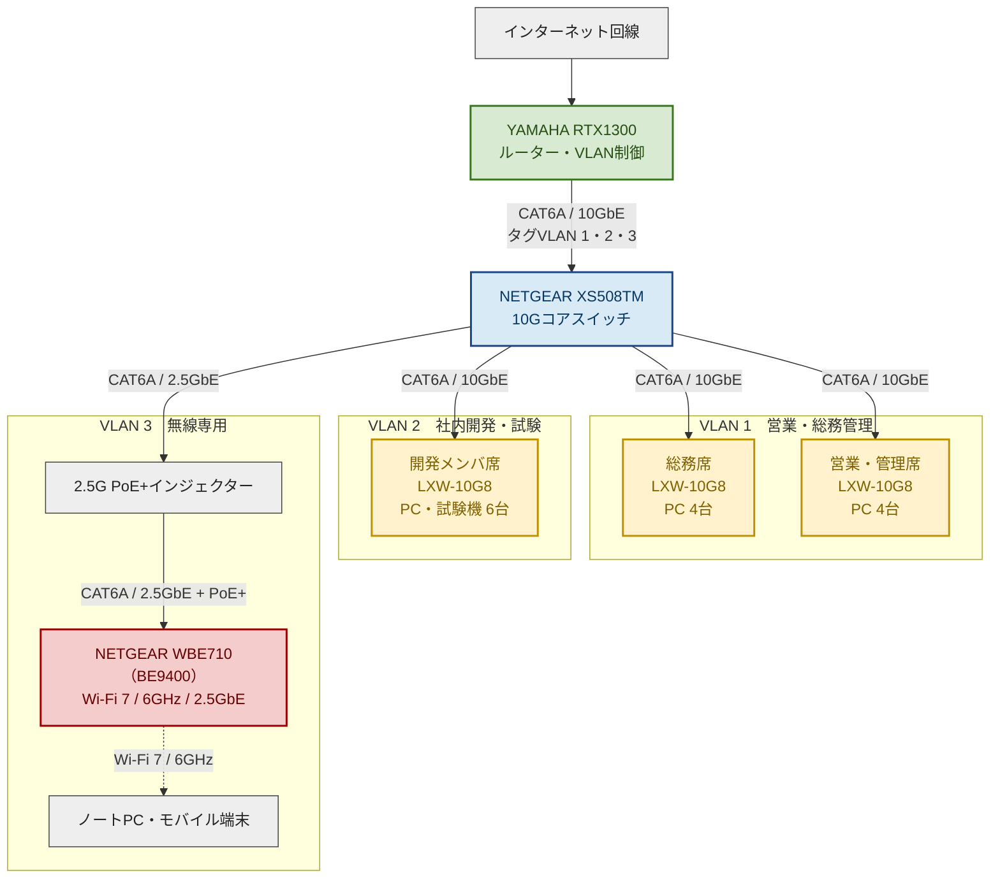

本資料は、ルーターから各エリアのアクセススイッチ、末端端末まで10Gbpsを基本とし、用途別に3つのVLANへ分離するネットワーク構成案です。無線LANには、Wi-Fi 7・6GHz帯・2.5GbEに対応する **NETGEAR WBE710（BE9400）** を採用します。

> 価格は2026年8月4日時点の税込参考価格です。販売店、在庫、送料、為替、保守契約により変動します。

---

## 1. ネットワーク構成図

PDF化した際にページ幅からはみ出さないよう、機器名と端末数を各ノード内に集約し、構成図を縦方向のコンパクトなレイアウトにしています。ケーブル種別と帯域は接続線に記載しています。

### ケーブル構成

| 接続区間 | 帯域 | ケーブル・給電 |
|---|---:|---|
| RTX1300 → XS508TM | 10GbE | CAT6A、タグVLAN 1・2・3 |
| XS508TM → 各LXW-10G8 | 10GbE | CAT6A |
| LXW-10G8 → 各端末 | 10GbE | CAT6A |
| XS508TM → PoE+インジェクター | 2.5GbE | CAT6A |
| PoE+インジェクター → WBE710（BE9400） | 2.5GbE | CAT6A、PoE+ |

---

## 2. 導入要件

- **フル10Gバックボーン**  
  RTX1300からXS508TM、各LXW-10G8、対応端末まで、CAT6Aによる10GbE接続を基本とします。

- **3系統のVLAN分離**  
  VLAN 1を営業・総務管理、VLAN 2を社内開発・試験、VLAN 3を無線専用として分離します。

- **Wi-Fi 7対応**  
  WBE710（BE9400）により2.4GHz、5GHz、6GHzのトライバンドを利用できます。有線アップリンクは2.5GbEです。

- **管理方式**  
  WBE710（BE9400）はヤマハLANマップによるAP一元管理の対象外です。単体管理またはNETGEAR Insightによる設定・監視を行います。

---

## 3. 概算費用

| 設置場所・用途    | 機器名・型番              |  数量 | 参考単価（税込） |      実価格 | 価格確認の考え方                    |
| ---------- | ------------------- | --: | -------: | -------: | --------------------------- |
| 全体統括・ルーター  | YAMAHA RTX1300      |  1台 | ¥250,000 | ￥220,000 | 流通在庫による変動が非常に大きいため、予算額として設定 |
| コアスイッチ     | NETGEAR XS508TM     |  1台 | ¥179,365 | \170,000 | NETGEAR公式通販価格               |
| 無線アクセスポイント | NETGEAR WBE710（BE9400）      |  1台 |   \54611 |  \55,000 | 購入先の実勢価格を参考           |
| AP用給電      | トレンドネット TPE-116GI/A |  1台 |   ¥3,182 |  \10,560 | 2.5GbE対応PoE+アダプター公式価格       |
| 開発メンバ席     | BUFFALO LXW-10G8    |  1台 |  ¥43,506 |  ¥44,000 | 価格比較サイトの市場最安価格を参考           |
| 総務席        | BUFFALO LXW-10G8    |  1台 |  ¥43,506 |  ¥44,000 | 同上                          |
| 営業・管理席     | BUFFALO LXW-10G8    |  1台 |  ¥43,506 |  ¥44,000 | 同上                          |
| 軽量UPS      | CyberPower ST425JP  |  1台 |   ¥8,339 |   \8,800 | 市場最安価格の参考値                  |
| **合計**     |                     |     | \626,015 | \596,360 | 配線工事、送料、設定作業、保守費用を除く        |

### 予算計上額

参考単価の合計は **601,768円** です。実際の購入時には価格変動や送料を考慮し、**機器購入費 約60万円**、余裕を持たせる場合は **約65万円** を予算額とするのが妥当です。

「実価格」列は、購入先と発注価格が確定した時点で記入するため、現段階では空欄としています。

### 価格確認結果

- **RTX1300**  
  市場価格が大きく変動するため、固定的な最安値ではなく25万円を予算単価としました。

- **XS508TM**  
  コアスイッチとしてVLANを管理するため、マネージド対応のXS508TMを継続採用します。

- **LXW-10G8**  
  XS508TMから各エリアまではCAT6Aによる10GBASE-T接続とし、SFP+は使用しません。各エリアは単一VLANを収容するため、8ポートすべてがRJ45の10GBASE-Tに対応するLXW-10G8へ変更します。参考単価は43,506円です。

- **WBE710（BE9400）**  
  Wi-Fi 7、6GHz帯、2.5GbEに対応し、国内での購入しやすさを重視して採用します。

- **PoE+アダプター**  
  WBE710（BE9400）の2.5GbEを維持するため、ギガビット専用ではなく2.5G対応モデルを採用します。

---

## 4. VLAN設計

| VLAN | 用途 | 接続先 | 主な端末 |
|---:|---|---|---|
| VLAN 1 | 営業・総務管理環境 | 総務席、営業・管理席 | 業務PC各4台 |
| VLAN 2 | 社内開発・試験環境 | 開発メンバ席 | 開発用PC・試験機6台 |
| VLAN 3 | 無線専用環境 | WBE710（BE9400） | ノートPC、モバイル端末 |

RTX1300とXS508TMの間は、VLAN 1・2・3を収容する10GbEのタグVLAN接続とします。XS508TMの各下位ポートを用途別のアンタグVLANとして設定し、各LXW-10G8は単一VLANのアンマネージドスイッチとして使用します。WBE710（BE9400）ではSSID別にVLANを設定します。

---

## 5. 構築・運用時の注意点

1. **LANケーブル**  
   10GbE区間にはCAT6A以上を使用します。既存配線を流用する場合は、ケーブルカテゴリーと敷設距離を確認します。

2. **WBE710（BE9400）の管理**  
   SSID、VLAN、ファームウェア更新、稼働監視は、Web管理画面またはNETGEAR Insightを使用します。管理方式とライセンス要否を導入前に確認します。

3. **6GHz帯の利用**  
   6GHz帯を利用できるのは対応クライアントのみです。既存端末は対応規格に応じて2.4GHzまたは5GHzへ接続します。

4. **スイッチのポート余裕**  
   各エリアにLXW-10G8を採用するため、端末4台のエリアでは増設余地があります。開発メンバ席は親接続を含めて7ポート使用する想定です。

5. **UPSの保護対象**  
   ST425JPはRTX1300、XS508TM、WBE710（BE9400）用PoE+インジェクターなどの基幹機器に限定して使用し、合計負荷を260W以内に収めます。

6. **価格の再確認**  
   特にRTX1300は価格変動が大きいため、発注直前に複数販売店で在庫と価格を再確認します。
   