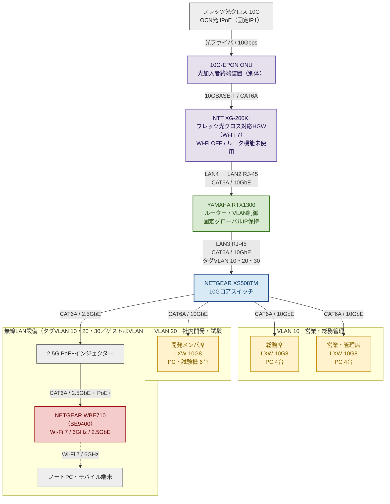

本資料は、ルーターから各エリアのアクセススイッチ、末端端末まで10Gbpsを基本とし、用途別に3つのVLANへ分離するネットワーク構成案です。無線LANには、Wi-Fi 7・6GHz帯・2.5GbEに対応する **NETGEAR WBE710（BE9400）** を採用します。

WAN側は、NTT東日本「フレッツ 光クロス（10Gbps）」で貸与される **10G-EPON ONU（光加入者終端装置・別体）と NTT XG-200KI（HGW）** を経由します（XG-200KIはONU一体型ではなく、光は別体ONUで終端し、ONUの10GBASE-T端子とXG-200KIのWAN端子をCAT6Aで接続）。XG-200KIはルータ機能を持つ機器ですが、本構成ではルータ機能を使用せず（接続先設定なし・Wi-Fi OFF）、LAN4からRTX1300へ10Gbpsで接続し、ルーティング・VLAN制御・VPNはRTX1300へ一元集約します。

なお、光クロスのIPv6アドレス配布方式は原則DHCPv6-PDですが、**XG-200KI配下にルータを設置する場合は例外的にRA方式**となります。RTX1300はRA方式で /64 を1本受け取る形になりプレフィックスを切り出せないため、**社内LAN（VLAN 10・20・30）はIPv4のみで運用**します。IPv6はHGW–RTX1300間のWAN区間で、IPv4 over IPv6トンネルの外側として使用するに留めます。構成方針の詳細は [[OCN_Hikari_Cross_RTX1300_Setup_Guide]] を参照してください（同資料はDHCPv6-PD方式を前提に記述されているため、方式選択のみ本資料の記載を優先します）。

> 価格は2026年8月4日時点の税込参考価格です。販売店、在庫、送料、為替、保守契約により変動します。

---

## 1. ネットワーク構成図

PDF化した際にページ幅からはみ出さないよう、機器名と端末数を各ノード内に集約し、構成図を縦方向のコンパクトなレイアウトにしています。ケーブル種別と帯域は接続線に記載しています。

### ケーブル構成

| 接続区間 | 帯域 | ケーブル・給電 |
|---|---:|---|
| フレッツ光クロス回線 → 10G-EPON ONU | 10Gbps | 光ファイバー（NTT工事） |
| 10G-EPON ONU → XG-200KI WAN | 10GBASE-T | CAT6A（**ONUは別体**） |
| XG-200KI LAN4 → RTX1300 LAN2 RJ-45 | 10GbE | CAT6A（WAN区間） |
| RTX1300 LAN3 → XS508TM Port 1 | 10GbE | CAT6A、タグVLAN 10・20・30 |
| XS508TM → 各LXW-10G8 | 10GbE | CAT6A |
| LXW-10G8 → 各端末 | 10GbE | CAT6A |
| XS508TM → PoE+インジェクター | 2.5GbE | CAT6A |
| PoE+インジェクター → WBE710（BE9400） | 2.5GbE | CAT6A、PoE+ |

---

## 2. 導入要件

- **WAN側10G接続（HGW経由）**  
  フレッツ光クロスは **10G-EPON ONU（別体）→ XG-200KI（HGW）** の順で受け（ONU↔XGは10GBASE-T/CAT6A）、XG-200KIの**LAN4**とRTX1300の**LAN2 RJ-45**をCAT6Aで10GbE接続し、WAN区間にボトルネックを作りません。

- **ルーター機能のRTX1300集約（二重ルータ回避）**  
  XG-200KIはWi-Fi OFF・接続先設定なしのパススルー運用とし、固定グローバルIPの保持、VLANルーティング、VPN終端はすべてRTX1300で行います。

- **社内LANはIPv4のみ**  
  HGW配下のRTX1300はRA方式でIPv6の /64 を1本受け取るだけでプレフィックスを切り出せないため、社内VLANへのIPv6配布は行いません。インターネット接続は固定グローバルIPv4 1個によるNAPTです。

- **フル10Gバックボーン**  
  RTX1300からXS508TM、各LXW-10G8、対応端末まで、CAT6Aによる10GbE接続を基本とします。

- **3系統のVLAN分離**  
  VLAN 10を営業・総務管理（192.168.128.0/24）、VLAN 20を社内開発・試験（192.168.64.0/24）、VLAN 30をゲスト専用（192.168.192.0/24）として分離します。社内の無線端末はSSID別にVLAN 10・20へ収容し、VLAN 30は来客端末専用としてVLAN 10・20への通信を拒否します。

- **Wi-Fi 7対応**  
  WBE710（BE9400）により2.4GHz、5GHz、6GHzのトライバンドを利用できます。有線アップリンクは2.5GbEです。

- **管理方式**  
  WBE710（BE9400）はヤマハLANマップによるAP一元管理の対象外です。単体管理またはNETGEAR Insightによる設定・監視を行います。

---

## 3. 概算費用

| 設置場所・用途    | 機器名・型番              |  数量 | 参考単価（税込） |      実価格 | 価格確認の考え方                    |
| ---------- | ------------------- | --: | -------: | -------: | --------------------------- |
| 全体統括・ルーター  | YAMAHA RTX1300      |  1台 | ¥250,000 | ￥220,000 | 流通在庫による変動が非常に大きいため、予算額として設定 |
| コアスイッチ     | NETGEAR XS508TM     |  1台 | ¥179,365 | \170,000 | NETGEAR公式通販価格               |
| 無線アクセスポイント | NETGEAR WBE710（BE9400）      |  1台 |   \54611 |  \55,000 | 購入先の実勢価格を参考           |
| AP用給電      | トレンドネット TPE-116GI/A |  1台 |   ¥3,182 |  \10,560 | 2.5GbE対応PoE+アダプター公式価格       |
| 開発メンバ席     | BUFFALO LXW-10G8    |  1台 |  ¥43,506 |  ¥44,000 | 価格比較サイトの市場最安価格を参考           |
| 総務席        | BUFFALO LXW-10G8    |  1台 |  ¥43,506 |  ¥44,000 | 同上                          |
| 営業・管理席     | BUFFALO LXW-10G8    |  1台 |  ¥43,506 |  ¥44,000 | 同上                          |
| 軽量UPS      | CyberPower ST425JP  |  1台 |   ¥8,339 |   \8,800 | 市場最安価格の参考値                  |
| **合計**     |                     |     | \626,015 | \596,360 | 配線工事、送料、設定作業、保守費用を除く        |

> **10G-EPON ONU（別体）と XG-200KI（HGW）はNTT東日本からの貸与機器**のため、上表の機器購入費には含みません（XG-200KIはONU一体型ではなく、ONUは別筐体で貸与）。別途、光クロスの月額基本料、機器の月額レンタル料、回線工事費が発生します（金額は要確認）。

### 予算計上額

参考単価の合計は **601,768円** です。実際の購入時には価格変動や送料を考慮し、**機器購入費 約60万円**、余裕を持たせる場合は **約65万円** を予算額とするのが妥当です。

「実価格」列は、購入先と発注価格が確定した時点で記入するため、現段階では空欄としています。

### 価格確認結果

- **RTX1300**  
  市場価格が大きく変動するため、固定的な最安値ではなく25万円を予算単価としました。

- **XS508TM**  
  コアスイッチとしてVLANを管理するため、マネージド対応のXS508TMを継続採用します。

- **LXW-10G8**  
  XS508TMから各エリアまではCAT6Aによる10GBASE-T接続とし、SFP+は使用しません。各エリアは単一VLANを収容するため、8ポートすべてがRJ45の10GBASE-Tに対応するLXW-10G8へ変更します。参考単価は43,506円です。

- **WBE710（BE9400）**  
  Wi-Fi 7、6GHz帯、2.5GbEに対応し、国内での購入しやすさを重視して採用します。

- **PoE+アダプター**  
  WBE710（BE9400）の2.5GbEを維持するため、ギガビット専用ではなく2.5G対応モデルを採用します。

---

## 4. VLAN設計

| VLAN | 用途 | ネットワーク | デフォルトGW | 接続先 | 主な端末 |
|---:|---|---|---|---|---|
| VLAN 10 | 営業・総務管理環境 | `192.168.128.0/24` | `192.168.128.1` | 総務席、営業・管理席、Office-WiFi | 業務PC各4台、プリンター、AKERUN |
| VLAN 20 | 社内開発・試験環境 | `192.168.64.0/24` | `192.168.64.1` | 開発メンバ席、Develop-WiFi | 開発用PC・試験機6台 |
| VLAN 30 | **ゲスト専用**環境 | `192.168.192.0/24` | `192.168.192.1` | Guest-WiFi（WBE710） | 来客端末 |

> 社内の無線端末はSSID別にVLAN 10・20へ収容します。VLAN 30は来客専用で、VLAN 10・20への通信をRTX1300で拒否します。IPアドレスの詳細設計（固定IP割当、保守セグメント、アクセス制御）は [[社内LANネットワーク設定]] を参照してください。

### VLAN間のアクセス制御方針

| 通信方向 | 可否 | 備考 |
|---|:--:|---|
| VLAN 10 → VLAN 20 | 許可 | 動的フィルタによる片方向許可（VLAN10発のセッションと戻り通信のみ） |
| VLAN 20 → VLAN 10 | 拒否 | 例外なし |
| VLAN 30 → VLAN 10・20 | 拒否 | ゲスト分離 |
| VLAN 10 → AWS VPC（`10.0.3.0/24`） | 許可 | 拠点間IPsec経由。業務系のみ |
| VLAN 20・30 → AWS VPC | 拒否 | － |
| VPN業務ユーザー（`192.168.201.16/28`） → VLAN 10 | 許可 | TCP 3389（RDP）／22（SSH）のみ |
| VPN開発ユーザー（`192.168.201.32/28`） → VLAN 20 | 許可 | TCP 3389（RDP）／22（SSH）のみ |

> **リモートアクセスVPN（L2TP/IPsec）** は、社外から自席PCへのリモートデスクトップ／SSH接続を主用途とします。L2TPクライアントはVLANに所属しないため、**ユーザーごとに固定IPを払い出し（`192.168.201.0/24`）、送信元IPレンジでフィルタを分岐**させて業務系・開発系を切り分けます。接続先PCはDHCP予約（`dhcp scope bind`）でIPを固定します。詳細は [[社内LANネットワーク設定]] を参照してください。

> **複合機（DocuCentre-VII C2273 / `192.168.128.20`）はVLAN 10に所属**します。社内は原則紙印刷禁止で、**VLAN 20 は紙媒体を直接・間接に利用しない**ため、複合機とVLAN 20 の間の通信は双方向とも不要です。VLAN 10 → VLAN 20 は原則許可ですが、**複合機発のVLAN 20 宛通信のみ例外的に拒否**し、複合機の通信範囲をVLAN 10 内に限定します。

RTX1300とXS508TMの間は、VLAN 10・20・30を収容する10GbEのタグVLAN接続とします。XS508TMの各下位ポートを用途別のアンタグVLANとして設定し、各LXW-10G8は単一VLANのアンマネージドスイッチとして使用します。WBE710（BE9400）ではSSID別にVLANを設定し、ゲスト用SSIDのみVLAN 30へ収容します。

---

## 5. 構築・運用時の注意点

1. **LANケーブル**  
   10GbE区間にはCAT6A以上を使用します。既存配線を流用する場合は、ケーブルカテゴリーと敷設距離を確認します。

2. **WBE710（BE9400）の管理**  
   SSID、VLAN、ファームウェア更新、稼働監視は、Web管理画面またはNETGEAR Insightを使用します。管理方式とライセンス要否を導入前に確認します。

3. **6GHz帯の利用**  
   6GHz帯を利用できるのは対応クライアントのみです。既存端末は対応規格に応じて2.4GHzまたは5GHzへ接続します。

4. **スイッチのポート余裕**  
   各エリアにLXW-10G8を採用するため、端末4台のエリアでは増設余地があります。開発メンバ席は親接続を含めて7ポート使用する想定です。

5. **UPSの保護対象**  
   ST425JPは**10G-EPON ONU（別体）**、**XG-200KI（HGW）**、RTX1300、XS508TM、WBE710（BE9400）用PoE+インジェクターなどの基幹機器に限定して使用し、合計負荷を260W以内に収めます。**ONU停電＝インターネット全断**のためONUもUPS保護対象とし、**ONU＋HGWで2台分**の電源口とラックスペースを確保します。**UPSは8個口あり口数の不足なし（確認済）**。ONUは DC12V/0.7A（≈8.4W・ACアダプタ給電）で追加負荷は軽微です（合計負荷は260W以内の想定）。

6. **価格の再確認**  
   特にRTX1300は価格変動が大きいため、発注直前に複数販売店で在庫と価格を再確認します。

7. **XG-200KI（HGW）の運用**  
   Wi-Fiは2.4GHz／5GHzともOFF、LAN1〜3は未使用とし、LAN4のみをRTX1300のLAN2へ接続します。固定IPサービスでは、ひかり電話契約の有無に関わらず `ONU – XG-200KI – ルータ` が必須構成であり、**HGWを外してRTX1300を回線に直結することはできません**。XG-200KIのLAN側は 192.168.1.0/24 で稼働し続けるため、社内VLANのサブネットと重複させません。HGW管理画面（192.168.1.1）へは、設定変更時のみ保守ターミナルをXG-200KIのLANポートへ一時直結してアクセスします。

8. **RTX1300のIPv6アドレス配布方式は「RA方式」（最重要）**  
   光クロスの原則はDHCPv6-PDですが、**XG-200KI配下にIPoEルータを設置する場合は例外的にRA方式**を選択します。誤ってDHCPv6-PD方式で設定すると、プレフィックスを正しく取得できずMAPルールが適用されないため、**IPv6は通信できるがIPv4が一切通らない**状態になります。開通当日に「IPv6は通るがIPv4が通らない」症状が出た場合は、まずこの方式選択を疑ってください。

9. **IPv6関連の設定注意点**  
   - RA方式ではRTX1300がプレフィックスを切り出せないため、社内VLANはIPv4のみで運用します。
   - RA方式ではDNS設定が自動で `dhcp lan2` となりHGWをDNSサーバとして参照するものの、到達経路が自動生成されずIPv6の名前解決に失敗する既知の事象があります。**DNSはパブリックDNSを直接指定**するか、静的経路を追加して回避します。

10. **要確認事項（HGW関連）**  
   - OCN光 IPoE（固定IP1）を利用する際に、XG-200KI側へ必要な設定（接続先設定の扱い、DMZ／ポート設定の要否）をOCN／NTT東日本へ確認します。
   - IPv4 over IPv6（MAP-E）上で、AWS VGW向けのIKE（UDP 500／4500）およびESPが問題なく通過するかを確認します。
   - フレッツ網から払い出されるIPv6プレフィックス長（/60等）を開通後に実機で確認します。
   