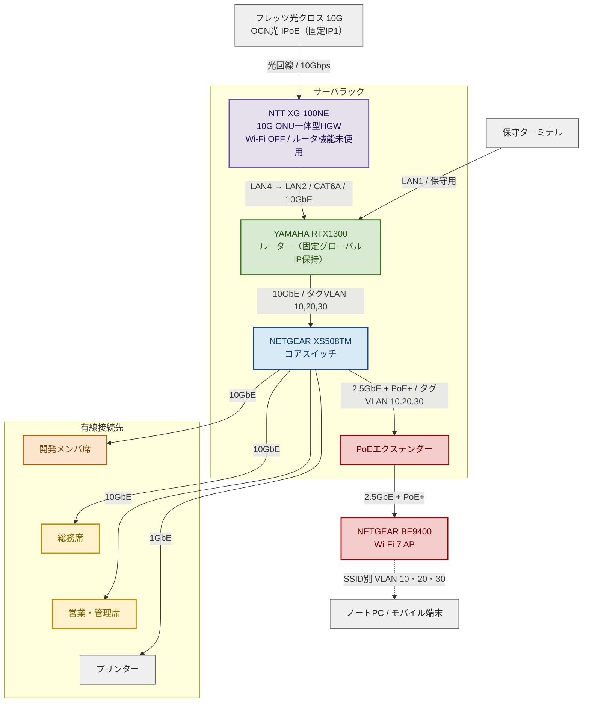
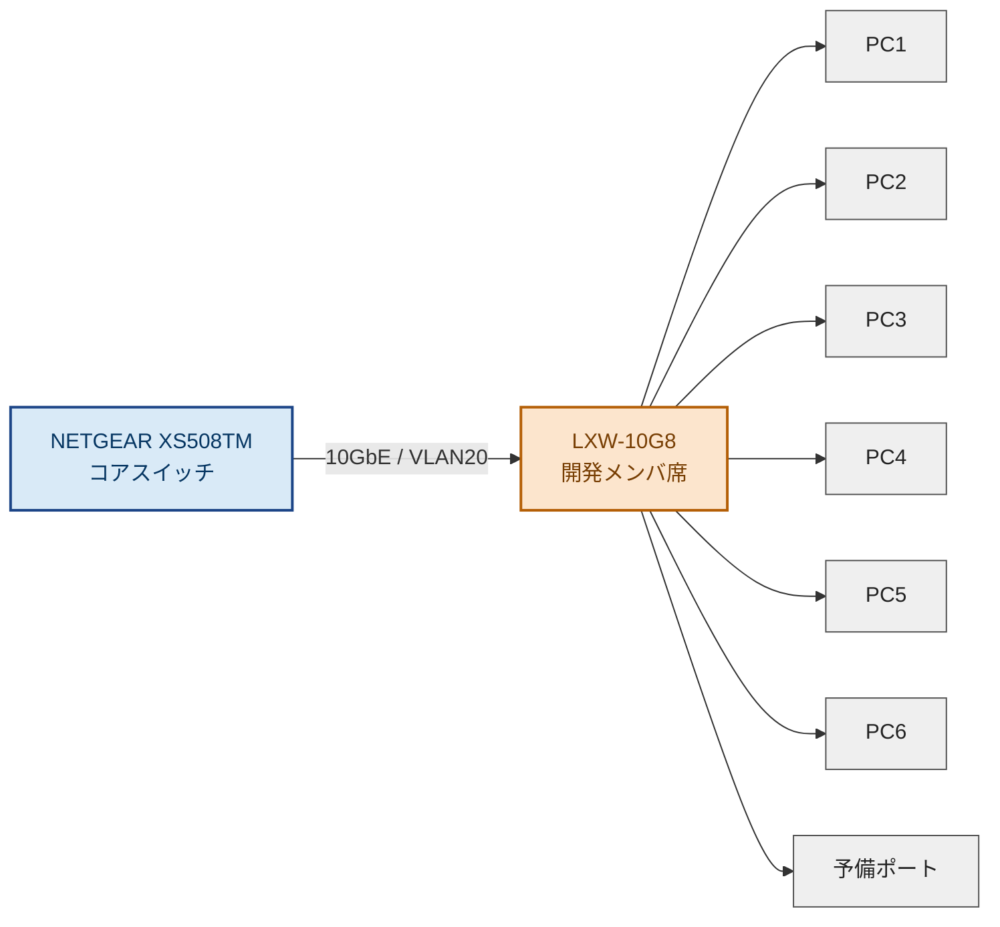
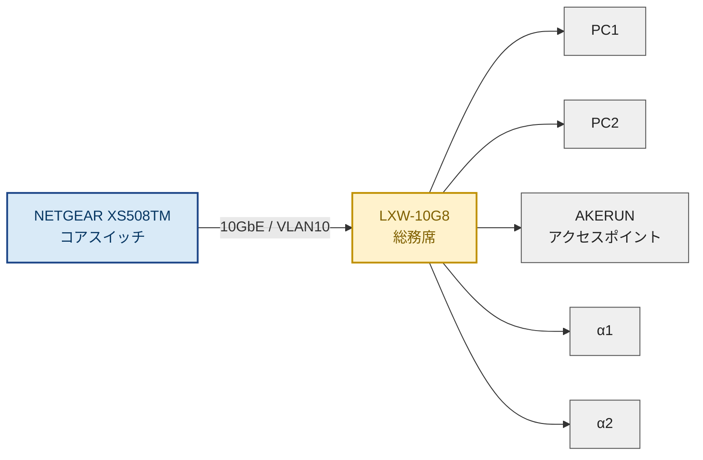
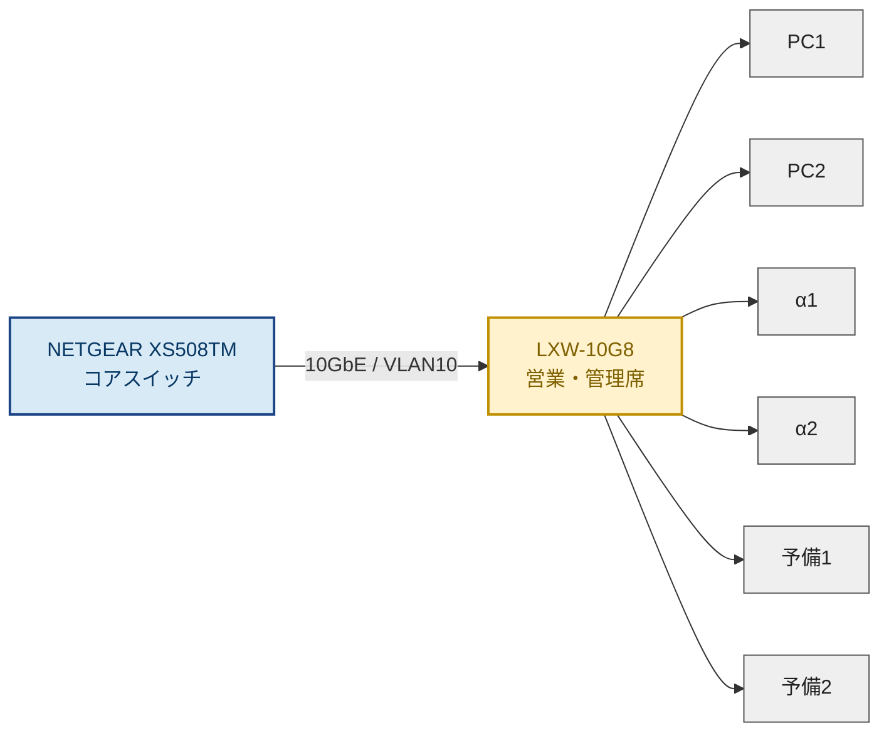

# ネットワーク機器ポート結線図（分割版・全体図簡略化）

本資料は、機器ポート結線図が小さく見づらい点を改善するため、**全体図**と**個別図**に分けて整理したものです。さらに、どのポートを使用するかが分かるよう、**ポート使用図**も追加しています。

- 回線は **フレッツ光クロス（10G）** で、**NTT XG-100NE（10G ONU一体型HGW）** を経由
- XG-100NEは **Wi-Fi OFF・LAN1〜3未使用・ルータ接続先設定なし**（パススルー運用）で、**LAN4 → RTX1300 LAN2** に接続
- RTX1300のIPv6アドレス配布方式は **RA方式**（HGW配下のため。PD方式にするとIPv4が通らない）
- **社内LAN（VLAN 10・20・30）はIPv4のみ**。IPv6はHGW–RTX1300間のWAN区間のみで使用
- VLAN10：営業・総務管理（192.168.128.0/24）
- VLAN20：開発メンバ席（192.168.64.0/24）
- VLAN30：ゲスト専用（192.168.192.0/24）
- 10GbE区間は **CAT6A** を前提
- 無線APは **NETGEAR BE9400** を使用
- 無線LANは **SSIDごとにVLAN 10・20・30を割り当て**
- 無線給電は **PoEエクステンダー** を使用
- **保守ターミナル** は RTX1300 の **LAN1** に接続

<div style="page-break-before:always"></div>

## 1. 全体図

> 見やすさを優先し、**個別図があるエリアは全体図ではBOX表現**としています。  
> 詳細な端末接続・ポート利用は、後続の個別図を参照してください。



### 全体結線の考え方

| 区間                          | 接続内容      | 帯域 / 備考                      |
| --------------------------- | --------- | ---------------------------- |
| フレッツ光クロス → XG-100NE 光ポート  | 回線引き込み    | 10Gbps / ONU一体型・NTT工事           |
| XG-100NE LAN4 → RTX1300 LAN2      | WAN接続      | 10GbE / CAT6A、HGWはパススルー運用      |
| 保守ターミナル → RTX1300 LAN1      | 保守用接続     | 1GbE想定                       |
| RTX1300 → XS508TM           | サーバラック内幹線 | 10GbE / タグVLAN 10,20,30         |
| XS508TM → 開発メンバ席LXW-10G8    | VLAN20幹線   | 10GbE                        |
| XS508TM → 総務席LXW-10G8       | VLAN10幹線   | 10GbE                        |
| XS508TM → 営業・管理席LXW-10G8    | VLAN10幹線   | 10GbE                        |
| XS508TM → プリンター             | VLAN10直結   | 1GbE想定                       |
| XS508TM → PoEエクステンダー        | 無線LAN幹線   | 2.5GbE + PoE+ / タグVLAN 10,20,30 |
| PoEエクステンダー → NETGEAR BE9400 | AP給電・接続   | 2.5GbE + PoE+ / タグVLAN透過     |

> ※ プリンターは **XS508TMから直結**、AKERUNのアクセスポイントは **総務席LXW-10G8配下** とします。  

### RTX1300 ポート使用図

RTX1300の前面パネルに近い配置で表現しています。

- LAN1は8ポートのL2スイッチで、**上段が1・3・5・7、下段が2・4・6・8**
- LAN2は右側上段、LAN3は右側下段
- LAN2・LAN3は、それぞれRJ-45とSFP+のコンボポート
- 本構成ではRJ-45側を使用し、SFP+側は未使用

> **RTX1300は「フレキシブルLAN/WANポート」機能を持ちます。** 物理10ポートを最大8個のLANインターフェース（LAN1〜LAN8）へ割り当て可能で、**工場出荷時は LAN1＝物理ポート1〜8／LAN2＝ポート9／LAN3＝ポート10** です。本設計はこの初期割り当てをそのまま使用します。詳細は 3-7 を参照してください。

#### ポート割当

| 番号 | 物理ポート | 接続先 | 用途 / 備考 |
|---:|---|---|---|
| ① | LAN1 ポート1 | 保守ターミナル | 設定変更・障害対応用 |
| ② | LAN2 RJ-45 | XG-100NE（HGW） LAN4 | 10GbE対応コンボポート（WAN） |
| ③ | LAN3 RJ-45 | XS508TM | 10GbE幹線、タグVLAN 10・20・30 |


#### 前面ポート配置イメージ

<table>
  <thead>
    <tr>
      <th colspan="2">CONSOLE</th>
      <th colspan="4">LAN1（8ポート L2スイッチ）</th>
      <th colspan="2">LAN2 / LAN3 コンボポート</th>
    </tr>
  </thead>
  <tbody>
    <tr>
      <td rowspan="2"><strong>mini-USB</strong><br>-</td>
      <td rowspan="2"><strong>RJ-45 CONSOLE</strong><br>-</td>
      <td><strong>1</strong><br>①</td>
      <td><strong>3</strong><br>-</td>
      <td><strong>5</strong><br>-</td>
      <td><strong>7</strong><br>-</td>
      <td><strong>LAN2 RJ-45</strong><br>②</td>
      <td><strong>LAN2 SFP+</strong><br>-</td>
    </tr>
    <tr>
      <td><strong>2</strong><br>-</td>
      <td><strong>4</strong><br>-</td>
      <td><strong>6</strong><br>-</td>
      <td><strong>8</strong><br>-</td>
      <td><strong>LAN3 RJ-45</strong><br>③</td>
      <td><strong>LAN3 SFP+</strong><br>-</td>
    </tr>
  </tbody>
</table>

> LAN1は、実機と同じく上段が **1・3・5・7**、下段が **2・4・6・8** です。  
> LAN2・LAN3は、それぞれRJ-45とSFP+のコンボポートで、同一LAN番号内では排他利用です。


**運用担当者向けポイント**

- 保守ターミナルは、LAN1の左上にある **ポート1** に接続します。
- LAN1の **ポート2～8は「-」で、空き**です。
- インターネット回線は、**XG-100NE（HGW）のLAN4** から **LAN2のRJ-45ポート**へ接続します。回線とRTX1300は直結ではありません。
- XS508TMへの10GbE幹線は **LAN3のRJ-45ポート**です。
- LAN2・LAN3のSFP+スロットは、対応するRJ-45ポートと排他のため、この構成では使用しません。

### XG-100NE（HGW）ポート使用図

フレッツ光クロスではONU一体型のXG-100NEが貸与機器として必須となるため、回線とRTX1300の間に必ず1台介在します。ルータ機能を持つ機器ですが、本構成では接続先設定を投入せず、RTX1300が固定グローバルIPを直接保持します。

#### ポート割当

| 番号 | ポート | 接続先 | 用途 / 備考 |
|---:|---|---|---|
| ① | 光ポート（WAN） | フレッツ光クロス回線 | 10Gbps / ONU一体型 |
| ② | LAN4（10GBASE-T） | RTX1300 LAN2 RJ-45 | 10GbE幹線、CAT6A |
| － | LAN1〜3（1000BASE-T） | 未使用 | 保守時のみ管理端末を一時接続 |

#### ポート使用図

| XG-100NE | 光 | LAN1 | LAN2 | LAN3 | LAN4 |
|---|---:|---:|---:|---:|---:|
| 使用番号 | ① | - | - | - | ② |

#### XG-100NE 側の設定要点

- **Wi-Fi（無線LAN）は常時OFF**（2.4GHz／5GHzともSSID発信を停止）。社内無線はBE9400に集約するため、平常時・メンテナンス時とも使用しません。
- **ルータの接続先設定は投入しません**（IPv4 over IPv6はRTX1300で終端）。
- **平常時に使用するのはLAN4のみ**。LAN1〜3は平常時未使用とし、**メンテナンス時（HGW管理画面へのアクセス時）にのみ使用**します。
- XG-100NEがNTT網からDHCPv6-PDでプレフィックスを取得し、**LAN側へはRA方式で /64 を1本広告**します。配下ルータへのプレフィックス再委任は行われません。
- XG-100NEには従来機（PR-500KI等）の完全なブリッジモードがないため、**LAN側 192.168.1.1/24 とDHCPサーバは動作したまま**になります。社内VLANのサブネットと重複させないでください。

#### HGW管理画面へのアクセス運用

- 通常運用では、HGW管理画面（`http://192.168.1.1/`）への常設経路は設けません。
- 設定変更・障害切り分けが必要な場合のみ、**保守ターミナルをXG-100NEのLAN1〜3いずれかへ一時的に直結**してアクセスし、作業後はケーブルを撤去します。
- 一時直結時は保守ターミナル側を DHCP（192.168.1.0/24）で受け取る想定です。

### IPv6アドレス配布方式とIPv4/IPv6の扱い

光クロスのIPv6アドレス配布方式は原則DHCPv6-PDですが、**XG-100NE配下にIPoEルータを設置する場合は例外的にRA方式**となります。RTX1300はRA方式で設定します。

```text
NTT網 ──(DHCPv6-PD /60)──▶ XG-100NE ──(RA で /64 を1本広告)──▶ RTX1300
                            ▲                                   ▲
                    PDを受け取るのはHGW                  RA方式で設定（PD不可）
```

| 項目               | 設定・扱い                         | 備考                                           |
| ---------------- | ----------------------------- | -------------------------------------------- |
| RTX1300のIPv6取得方式 | **RA方式**                      | PD方式にするとMAPルールが適用されず**IPv4が一切通らない**          |
| WAN側IPv6         | RAで受けた /64 ＋ OCN指定のインターフェースID | IPv4 over IPv6トンネルの始点                        |
| グローバルIPv4        | 固定IP1をRTX1300が保持              | VPN（L2TP/IPsec、AWS VGW）はRTX1300で終端           |
| 社内VLAN 10・20・30のIPv6  | **配布しない（IPv4のみ）**             | RA方式ではプレフィックスを切り出せないため                       |
| 社内VLAN 10・20・30のIPv4  | RTX1300がDHCP配布・NAPTでインターネットへ  | 従来のPPPoE運用と同等                                |
| DNS              | **パブリックDNSを直接指定**             | RA方式時に `dhcp lan2` 自動設定でIPv6名前解決に失敗する既知事象の回避 |

> **開通当日の切り分け指針**  
> ・IPv6は通るがIPv4が通らない → **RTX1300のIPv6取得方式がPDになっていないか**を最初に確認  
> ・IPv4は通るがIPv6が通らない → DNS設定（`dhcp lan2`）とIPv6経路を確認

> 切替当日の実施手順・症状別の切り分け表・切り戻し手順は [[切替・障害切り分け手順]] にまとめています。

### XS508TM ポート使用図

#### ポート割当

|  番号 | ポート    | 接続先             | 備考                           |
| --: | ------ | --------------- | ---------------------------- |
|   ① | Port 1 | RTX1300 LAN3    | 10GbE幹線、タグVLAN 10・20・30         |
|   ② | Port 2 | 開発メンバ席 LXW-10G8 | 10GbE / VLAN20                |
|   ③ | Port 3 | 総務席 LXW-10G8    | 10GbE / VLAN10                |
|   ④ | Port 4 | 営業・管理席 LXW-10G8 | 10GbE / VLAN10                |
|   ⑤ | Port 5 | PoEエクステンダー      | 2.5GbE + PoE+ / タグVLAN 10・20・30 |
|   ⑥ | Port 6 | プリンター           | 1GbE / VLAN10                 |


| XS508TM | 1 | 2 | 3 | 4 | 5 | 6 | 7 | 8 |
|---|---:|---:|---:|---:|---:|---:|---:|---:|
| 使用番号 | ① | ② | ③ | ④ | ⑤ | ⑥ | - | - |

### PoEエクステンダー ポート使用図

#### ポート割当

| 番号 | ポート | 接続先 | 備考 |
|---:|---|---|---|
| ① | IN | XS508TM Port 5 | 2.5GbE入力、タグVLAN透過 |
| ② | OUT | NETGEAR BE9400 | 2.5GbE + PoE+ |


| PoEエクステンダー | IN | OUT |
|---|---:|---:|
| 使用番号 | ① | ② |

### 無線LAN SSID・VLAN設計

NETGEAR BE9400では、SSIDごとに接続先VLANを分けます。無線端末は、接続したSSIDに応じて営業・総務管理、開発、ゲストの各ネットワークへ収容されます。

| SSID例 | 用途 | 割当VLAN | 主な利用者・端末 |
|---|---|---:|---|
| `Office-WiFi` | 営業・総務管理用 | VLAN 10 | 営業、総務、管理部門のノートPC・モバイル端末 |
| `Develop-WiFi` | 開発用 | VLAN 20 | 開発メンバーのノートPC・検証端末 |
| `Guest-WiFi` | ゲスト用 | VLAN 30 | 来客端末、社内ネットワークへ接続させない端末 |

> **VLAN30はゲスト専用**です。社内の無線端末はOffice-WiFi（VLAN10）／Develop-WiFi（VLAN20）に収容し、有線と同じセグメントに入ります。

#### 無線LAN側の設定要点

- **XS508TM Port 5** は、VLAN 10・20・30を通すタグ付きポートとして設定します。
- **PoEエクステンダー** は、VLANタグを変更せず透過させます。
- **NETGEAR BE9400** では、各SSIDに対応するVLAN IDを設定します。
- **RTX1300** では、各VLANのDHCP、ルーティング、アクセス制御を設定します。
- ゲスト用のVLAN 30は、インターネット接続のみ許可し、VLAN 10・20への通信を拒否します。

```text
Office-WiFi  → VLAN 10（営業・総務管理）
Develop-WiFi → VLAN 20（開発）
Guest-WiFi   → VLAN 30（ゲスト / 社内ネットワークから分離）
```

<div style="page-break-before:always"></div>

## 2. 個別図

### 2-1. 開発メンバ席（VLAN20）



#### 開発メンバ席 ポート割当

| 番号 | ポート | 接続先 | 備考 |
|---:|---|---|---|
| ① | Port 1 | XS508TM Port 2 | 10GbE uplink / VLAN20 |
| ② | Port 2 | PC1 | 10GbE |
| ③ | Port 3 | PC2 | 10GbE |
| ④ | Port 4 | PC3 | 10GbE |
| ⑤ | Port 5 | PC4 | 10GbE |
| ⑥ | Port 6 | PC5 | 10GbE |
| ⑦ | Port 7 | PC6 | 10GbE |

#### 開発メンバ席 ポート使用図

| LXW-10G8 | 1 | 2 | 3 | 4 | 5 | 6 | 7 | 8 |
|---|---:|---:|---:|---:|---:|---:|---:|---:|
| 使用番号 | ① | ② | ③ | ④ | ⑤ | ⑥ | ⑦ | - |

<div style="page-break-before:always"></div>

### 2-2. 総務席（VLAN10）



#### 総務席 ポート割当

| 番号 | ポート | 接続先 | 備考 |
|---:|---|---|---|
| ① | Port 1 | XS508TM Port 3 | 10GbE uplink / VLAN10 |
| ② | Port 2 | PC1 | 10GbE |
| ③ | Port 3 | PC2 | 10GbE |
| ④ | Port 4 | AKERUNアクセスポイント | VLAN10 |

#### 総務席 ポート使用図

| LXW-10G8 | 1 | 2 | 3 | 4 | 5 | 6 | 7 | 8 |
|---|---:|---:|---:|---:|---:|---:|---:|---:|
| 使用番号 | ① | ② | ③ | ④ | - | - | - | - |

---

### 2-3. 営業・管理席（VLAN10）



#### 営業・管理席 ポート割当

| 番号 | ポート | 接続先 | 備考 |
|---:|---|---|---|
| ① | Port 1 | XS508TM Port 4 | 10GbE uplink / VLAN10 |
| ② | Port 2 | PC1 | 10GbE |
| ③ | Port 3 | PC2 | 10GbE |

#### 営業・管理席 ポート使用図

| LXW-10G8 | 1 | 2 | 3 | 4 | 5 | 6 | 7 | 8 |
|---|---:|---:|---:|---:|---:|---:|---:|---:|
| 使用番号 | ① | ② | ③ | - | - | - | - | - |

<div style="page-break-before:always"></div>

## 3. IPアドレス設計

### 3-1. セグメント一覧

| VLAN | 用途 | ネットワーク | デフォルトGW（RTX1300） | DHCP配布範囲 | 固定IP割当範囲 | 予備 |
|---:|---|---|---|---|---|---|
| VLAN 10 | 営業・総務管理 | `192.168.128.0/24` | `192.168.128.1` | `.100`〜`.149`（予約）／`.150`〜`.199`（自動） | `.2` 〜 `.99` | `.200` 〜 `.254` |
| VLAN 20 | 社内開発・試験 | `192.168.64.0/24` | `192.168.64.1` | `.100`〜`.149`（予約）／`.150`〜`.199`（自動） | `.2` 〜 `.99` | `.200` 〜 `.254` |
| VLAN 30 | ゲスト専用 | `192.168.192.0/24` | `192.168.192.1` | `.100` 〜 `.199`（自動のみ） | 割当なし | `.200` 〜 `.254` |
| （参考） | 保守セグメント（RTX1300 LAN1） | `192.168.200.0/24` | `192.168.200.1` | `.100` 〜 `.199` | `.2` 〜 `.99` | － |
| （参考） | VPNクライアント払い出し | `192.168.201.0/24` | － | プール未使用（ユーザー別固定） | `.17`〜`.30` / `.33`〜`.46` | － |
| （参考） | HGW管理（XG-100NE LAN側） | `192.168.1.0/24` | `192.168.1.1`（HGW） | HGWのDHCP | － | 変更不可 |

- サブネットマスクはすべて `/24`（255.255.255.0）です。
- DHCPサーバはRTX1300が各VLANに対して配布します（VLAN 10・20・30）。
- **`.100`〜`.149` はDHCP予約（`dhcp scope bind`）用**です。リモートデスクトップ／SSHの接続先となるPCは、MACアドレスに紐付けて常に同じIPを配布します（詳細は 3-6）。
- ゲスト用VLAN 30には固定IP機器を置きません。
- VPNクライアント払い出しセグメント `192.168.201.0/24` はRTX1300の `pp anonymous` インターフェースに終端され、VLANには所属しません（詳細は 3-6）。

### 3-2. 保守セグメント（RTX1300 LAN1）について

RTX1300の **LAN1は8ポートのL2スイッチで、LAN3のタグVLANとは別の物理インターフェース**です。そのため、保守ターミナルをLAN1に接続する構成では、**LAN1に独立したセグメントを割り当てる必要**があります。

| 方式 | 内容 | 評価 |
|---|---|---|
| **案A：専用セグメント**（推奨） | LAN1に `192.168.200.0/24` を割り当て、保守ターミナル専用とする | 設定が単純。業務セグメントと分離され、保守端末の紛失・持ち出し時の影響も小さい |
| 案B：VLAN10に参加させる | LAN1をブリッジ等でVLAN10（`192.168.128.0/24`）に収容する | 保守端末から業務セグメントへ直接アクセスできるが、設定が複雑になり分離のメリットを失う |

> 本設計では **案A（`192.168.200.0/24`）を採用**します。保守ターミナルからVLAN 10・20へアクセスする必要がある場合は、RTX1300のフィルタで必要な通信のみ許可します。

### 3-3. 固定IP割当（VLAN 10 / `192.168.128.0/24`）

| 機器 | 接続先 | IPアドレス | 備考 |
|---|---|---|---|
| RTX1300（VLAN10 GW） | － | `192.168.128.1` | 確定 |
| XS508TM（管理IP） | Port 1 経由 | `192.168.128.2` | 確定。マネージドSWのため管理IPが必要 |
| WBE710（BE9400）管理IP | PoEエクステンダー経由 | `192.168.128.3` | 確定。AP管理用（NETGEAR Insight利用時も要） |
| （Web公開サーバ） | － | **今回は設置しない** | サーバ群はAWS移行済み。公開環境は新構成に合わせ別途検討（→ [[現行config棚卸し]] 3章） |
| DocuCentre-VII C2273（複合機） | XS508TM Port 6 直結 | `192.168.128.20` | 確定。**VLAN10専用**。社内は原則紙印刷禁止のため、スキャン等の利用が主体 |
| AKERUN コントローラ（AP） | 総務席 LXW-10G8 Port 4 | **DHCP**（`.150`〜`.199` 自動払い出し） | 固定IP・DHCP予約とも不要。クラウドへの外向き通信のみで着信不要 |
| 業務PC（総務・営業・管理） | 各LXW-10G8 | DHCP（`.100`〜） | 固定不要 |

> LXW-10G8はアンマネージドスイッチのため管理IPは不要です。

### 3-4. アクセス制御方針

| 通信方向 | 可否 | 実装・備考 |
|---|:--:|---|
| VLAN 10 → VLAN 20 | **許可** | **動的フィルタ（`ip filter dynamic`）による片方向許可**。VLAN10発のセッションと、その戻り通信のみ通す |
| VLAN 20 → VLAN 10 | **拒否** | **例外なし**（VLAN20は紙媒体を扱わないため印刷・スキャンの例外も不要） |
| 複合機（`192.168.128.20`） → VLAN 20 | **拒否** | VLAN 10 → VLAN 20 許可の**例外**。VLAN20は紙媒体を直接・間接に利用しないため、複合機発のVLAN20向け通信を静的フィルタで遮断し、複合機の通信範囲をVLAN 10 内に限定する |
| VLAN 30（ゲスト） → VLAN 10・20 | **拒否** | ゲスト分離 |
| VLAN 30（ゲスト） → インターネット | 許可 | ゲストはインターネット接続のみ |
| VLAN 10 → AWS VPC（`10.0.3.0/24`） | 許可（**事後対応**） | 拠点間IPsecは今回の切替スコープ外。代替ルートで運用し、回線切替後に構築 |
| VLAN 20・VLAN 30 → AWS VPC | **拒否** | 開発系・ゲストからAWSへは接続しない |
| VPN業務ユーザー（`192.168.201.16/28`） → VLAN 10 | **許可** | **TCP 3389（RDP）／TCP 22（SSH）のみ**。他ポートは拒否 |
| VPN開発ユーザー（`192.168.201.32/28`） → VLAN 20 | **許可** | **TCP 3389（RDP）／TCP 22（SSH）のみ**。他ポートは拒否 |
| VPNユーザー → 上記以外（他VLAN・複合機・AWS・保守セグメント） | **拒否** | 最小権限。用途はリモートデスクトップ／SSHに限定 |
| インターネット → 社内（着信） | **拒否** | 今回はインバウンド公開を設けない。VPN終端（IKE/ESP/L2TP）のみ自機宛で許可 |
| 保守セグメント → VLAN 10・20 | 許可 | 保守作業用 |
| VLAN 10・20・30 → 保守セグメント | 拒否 | 保守は片方向（保守 → 業務）のみ |
| VLAN 10・20 → インターネット | 許可 | 固定グローバルIPv4によるNAPT |
| 各VLAN → HGW（`192.168.1.0/24`） | 拒否 | 保守時の一時直結でのみアクセス |

#### 実装上の注意

- **「片方向許可」はセッション開始方向の話**です。静的フィルタ（`ip filter`）だけで「VLAN10→VLAN20 を許可、VLAN20→VLAN10 を拒否」と設定すると**戻りパケットも落ちて通信不能**になります。必ず動的フィルタ（`ip filter dynamic`）でステートフルに扱ってください。
- 実装の型は「**宛先側インターフェース（`lan3/2`）の `in` で相手発を拒否し、`out` に静的 `pass` ＋ `dynamic` を置く**」です。ヤマハ公式設定例と同じ構造です。具体的なコマンドは [[config_RTX1300]] 9章を参照してください。
- **VLAN10・VLAN30 側のインターフェースには `secure filter out` を設定しません。** `out` に静的 `reject` を置くと、インターネットやVLAN20からの**戻りパケットまで落ちる**ためです。
- **動的フィルタはICMPを扱えません。** そのためVLAN間の ping は通りません（TCP/UDPは通ります）。**疎通確認はTCPで実施**してください。
- **VLAN 20 は紙媒体を直接・間接に利用しません。** したがって複合機（`192.168.128.20`）とVLAN 20 の間の通信は、印刷・スキャンとも**双方向で一切不要**です。
  - VLAN20 → 複合機（印刷、管理画面、スキャンボックス取得）：VLAN20→VLAN10の拒否により遮断されます。**例外許可は設けません。**
  - 複合機 → VLAN20（スキャンのSMB／FTP送信）：VLAN10→VLAN20は原則許可のため通ってしまいます。これを防ぐため、**送信元 `192.168.128.20` からVLAN 20 宛の通信を静的フィルタで明示的に拒否**し、動的フィルタの許可より前段に配置します。
  - 結果として複合機の通信範囲はVLAN 10 内（＋必要な外部通信）に限定されます。複合機はファームウェア更新頻度が低く踏み台になりやすい機器のため、この制限は防御上も有効です。
- AKERUN アクセスポイントはVLAN10に所属し、クラウドへの外向き通信（インターネット方向）を許可します。
- AWS向けの通信はVLAN10のみのため、**開発・検証用途でAWSへ接続する必要が生じた場合は本方針の見直し**が必要です。

### 3-5. サブネット重複チェック

| セグメント | 用途 | 重複判定 |
|---|---|:--:|
| `192.168.1.0/24` | XG-100NE（HGW）LAN側 | ✅ 重複なし |
| `192.168.64.0/24` | VLAN 20 | ✅ 重複なし |
| `192.168.128.0/24` | VLAN 10 | ✅ 重複なし |
| `192.168.192.0/24` | VLAN 30 | ✅ 重複なし |
| `192.168.200.0/24` | 保守セグメント | ✅ 重複なし |
| `192.168.201.0/24` | VPNクライアント払い出し（L2TP/IPsec） | ✅ 重複なし |
| `10.0.3.0/24` | AWS VPC（拠点間VPN接続先） | ✅ 重複なし（`192.168.x.x` とアドレス空間が異なる） |

> HGWの `192.168.1.0/24` は変更できないため、社内セグメントを `192.168.1.x` に置くことは禁止です。

### 3-6. リモートアクセスVPN（L2TP/IPsec）設計

主な用途は **社外から自席PCへのリモートデスクトップ（RDP）／SSH接続** です。

#### 方式：VLANに入れるのではなく「払い出しIPで切り分ける」

L2TP/IPsecクライアントはRTX1300の **`pp anonymous` インターフェース**に終端され、VLANインターフェースには所属しません。また **anonymous pp は1つしか作成できない**ため、「ユーザーごとに別のVLANへ収容する」ことはできません。

代わりに、**ユーザーごとに固定IPを払い出し、送信元IPレンジでフィルタを分岐**させることで同等の制御を行います。

#### 払い出しセグメント（VPN専用 `192.168.201.0/24`）

| 区分 | 払い出しレンジ | 到達範囲 | 許可ポート |
|---|---|---|---|
| 業務ユーザー | `192.168.201.16/28`（`.17`〜`.30`） | VLAN 10 `192.168.128.0/24` のみ | TCP 3389（RDP）／TCP 22（SSH） |
| 開発ユーザー | `192.168.201.32/28`（`.33`〜`.46`） | VLAN 20 `192.168.64.0/24` のみ | TCP 3389（RDP）／TCP 22（SSH） |

**アカウント割当（確定）**

| アカウント | 区分 | 払出IP |
|---|---|---|
| `yohira` | 業務 | `192.168.201.17` |
| `t.kido` | 業務 | `192.168.201.18` |
| `mogik` | 業務 | `192.168.201.19` |
| `iizuka` | 業務 | `192.168.201.20` |
| `yohiradev` | 開発 | `192.168.201.33` |
| `t.kidodev` | 開発 | `192.168.201.34` |

> 利用者4名／アカウント6個。業務と開発の両方を使う2名は**用途別に別アカウント**で接続します。1アカウントで両方へ到達させることも技術的には可能ですが（フィルタ次第）、セッション単位の権限を最小に保つため分離しています。

- 業務ユーザーは AWS VPC・VLAN 20・VLAN 30・複合機・保守セグメントへ到達できません。
- 開発ユーザーは VLAN 10（複合機含む）・AWS VPC・VLAN 30・保守セグメントへ到達できません。
- **`/28` のサブネット境界に揃えている**ため、フィルタをレンジ1行で記述できます。各区分14ユーザーまで収容可能で、不足時は `/28` を追加します。

#### ユーザーごとの固定IP割り当て

```
pp select anonymous
 pp auth username <業務ユーザー名>  <パスワード> 192.168.201.17
 pp auth username <開発ユーザー名>  <パスワード> 192.168.201.33
```

- `pp auth username` の**第3引数で払い出しIPを指定**します。
- **固定指定したIPは `ip pp remote address pool` の範囲と重複させないこと。** 重複するとプールから別アドレスが払い出され、フィルタが意図通りに効きません。本設計では**全ユーザーを固定指定とし、プールは使用しません**。
- 同時接続数はバインドするトンネル数に依存します（`pp bind tunnel1-tunnelN`）。必要ユーザー数分のトンネルを用意します。

#### フィルタ設定（イメージ）

```
ip filter 200 pass 192.168.201.16/28 192.168.128.0/24 tcp * 3389
ip filter 201 pass 192.168.201.16/28 192.168.128.0/24 tcp * 22
ip filter 202 pass 192.168.201.32/28 192.168.64.0/24  tcp * 3389
ip filter 203 pass 192.168.201.32/28 192.168.64.0/24  tcp * 22
ip filter 299 reject * * * * *

pp select anonymous
 ip pp secure filter in 200 201 202 203 299
```

> フィルタ番号と適用順序は、既存のVLAN間フィルタと整合させて実装時に確定します。

#### RDP／SSH接続先PCのIP安定化（DHCP予約）

接続先が自席PCであるため、**DHCPでIPが変動するとRDP／SSHの宛先を指定できません**。RTX1300のDHCP予約でMACアドレスに固定します。

```
dhcp scope bind 1 192.168.128.101 <PCのMACアドレス>
```

- PC側は「IPアドレスを自動的に取得する」のままでよく、**端末側の設定変更は不要**です。
- 予約アドレスは各VLANの `.100`〜`.149` から採ります（DHCPスコープ内である必要があります）。
- **必要なのはVPNでRDP／SSH接続する対象PCのMACアドレスのみ**です。全PC分を収集する必要はありません（VPNを使わないPCは自動払い出し `.150`〜`.199` のままでよい）。
- MACアドレスと利用者の対応は、`dhcp scope bind` の設定だけでは「どのMACが誰のPCか」が分からなくなるため、下表の形で本資料に記録します。

| 利用者 | PC名      | VLAN | MACアドレス           | 予約IP            |
| --- | -------- | ---: | ----------------- | --------------- |
| 大平  | ALPHA133 |    1 | E8-CF-83-4E-37-5D |  192.168.128.10 |

#### 注意点

- **Windowsファイアウォールの許可範囲**：RDPの受信規則が「ローカルサブネットのみ」に絞られている場合、別セグメント（`192.168.201.x`）からの接続が拒否されます。切替前に確認してください。
- **Linux端末のSSH**：`sshd` の `AllowUsers` やファイアウォール（firewalld／ufw）でアクセス元を制限している場合も同様に `192.168.201.0/24` の許可が必要です。
- RTX1300は **OCNバーチャルコネクト 固定IP1 + L2TP/IPsec の公式設定例が提供されています**（Rev.23.00.17以降）。
- **要確認**：RTX1300のL2TP/IPsec同時接続数の上限（機種仕様）。

### 3-7. RTX1300 LAN1（8ポート）のVLAN設定可否

保守用端末を接続するRTX1300のLAN1について、**VLANを設定できるかどうか**の整理です。

#### 前提：RTX1300は従来機と方式が異なる

| 項目 | RTX1200／RTX1210 | **RTX1300** |
|---|---|---|
| LAN1内のポート分割 | LAN分割機能（`lan type lan1 port-based-option=divide-network` ＋ `vlan port mapping`） | **従来のLAN分割機能は使用不可**。フレキシブルLAN/WANポート機能で代替 |
| 物理ポート構成 | 固定 | **物理10ポートを最大8個のLANインターフェースへ自由に割り当て可能** |

> RTX1200/1210向けの設定記事にある `vlan port mapping` の手順を**そのまま持ち込むと動作しません**。

#### 実現方法の選択肢

| やりたいこと | 方法 | 注意点 |
|---|---|---|
| LAN1の一部ポートを別セグメントにする | `lan flexible-port lan1=1-6 lan4=7 lan5=8` のようにポートを別のLANインターフェースへ切り出し、各インターフェースにIPを付与 | **`save` + `restart` が必要**。全ポートをいずれかのLANへ割り当てること、LAN1に最低1ポートは必要 |
| LAN1にタグVLAN（802.1Q）を載せる | LANインターフェース単位で設定 | **8ポート全部がタグポートになる**ため、タグ非対応の保守端末が接続できなくなる |
| 業務VLANの端末を接続する | **XS508TM側へ接続する** | 追加設定不要。通常はこちらを選択 |

#### 本設計の方針

**LAN1の8ポートは分割せず、全体を保守セグメント `192.168.200.0/24` として使用します**（工場出荷時の割り当てのまま）。

- 保守用端末は LAN1 ポート1 に接続。残る7ポートは同一セグメントの空きポートです。
- 将来LAN1の空きポートへ業務端末を接続したくなった場合のみ、上表の対応を検討します。
- フレキシブルポートの割り当てを変更すると**再起動が必要**なため、切替当日の変更は避けてください。

<div style="page-break-before:always"></div>

## 4. 補足

- 本資料は**結線の見やすさを優先**して、全体図と個別図に分割しています。
- 実際のポート番号は、ラック配置・配線距離・機器の設置位置に合わせて最終調整してください。
- プリンターはVLAN10として **XS508TMへ直結** します。
- AKERUNのアクセスポイントはVLAN10として **総務席LXW-10G8へ接続** します。
- 保守ターミナルは **RTX1300 の LAN1** へ接続し、設定変更・障害対応用に使用します。HGW管理画面へアクセスする場合のみ、XG-100NEへ一時直結します。
- 回線とRTX1300の間には **XG-100NE（10G ONU一体型HGW）** が必ず介在します。撤去・バイパスはできません。
- XG-100NEは1台分の**電源口とラックスペース**を占有し、UPSの保護対象に含めます。
- 無線LANはSSIDごとにVLAN 10・20・30へ分離し、ゲスト用VLAN 30から社内VLAN 10・20への通信はRTX1300で拒否します。
- 本物の画像ベースにしたい場合は、**XG-100NE / XS508TM / LXW-10G8 / RTX1300 / BE9400 / PoEエクステンダー** の前面画像をご提供いただければ、その画像上に「Port 1 = uplink」などの注記を入れる形で、より実機に近い資料へできます。

### HGW関連の確定事項

| 項目 | 決定内容 |
|---|---|
| HGWの介在 | 固定IPサービスでは、ひかり電話契約の有無に関わらず `ONU – XG-100NE – ルータ` が必須構成。**HGWを外した回線直結は不可** |
| IPv6取得方式 | HGW配下のため **RA方式**（光クロスの原則はPDだが本構成は例外） |
| 社内IPv6 | **配布しない（社内LANはIPv4のみ）** |
| DNS | パブリックDNSを直接指定 |
| HGW管理 | 設定変更時のみ保守ターミナルを一時直結 |

### 要確認事項（HGW関連）

| 項目 | 内容 | 確認先 |
|---|---|---|
| HGW側の必要設定 | 固定IP1利用時にXG-100NE側へ必要な設定（接続先設定の扱い、DMZ／ポート設定の要否） | OCN / NTT東日本 |
| VPNの通過性 | MAP-E上でAWS VGW向けのIKE（UDP 500／4500）およびESPが通過するか | OCN / 社内検証 |
| IPアドレス重複 | XG-100NEのLAN側 192.168.1.0/24 と社内VLANサブネットが重複しないこと（**VLAN毎のIP設計表が未作成**） | 社内 |
| プレフィックス長 | フレッツ網から払い出されるIPv6プレフィックス長（/60等）を開通後に実機確認 | 開通後確認 |

> HGW–RTX1300間の構成方針の詳細は、参考資料 [[OCN_Hikari_Cross_RTX1300_Setup_Guide]] を参照してください。ただし同資料はIPv6取得方式をDHCPv6-PDとして記述しているため、**方式選択については本資料（RA方式）を優先**します。
