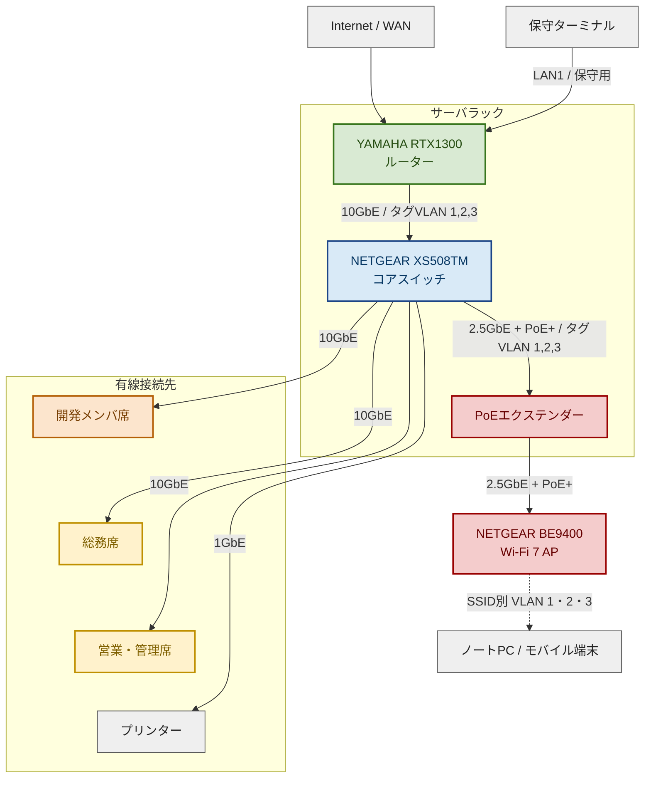
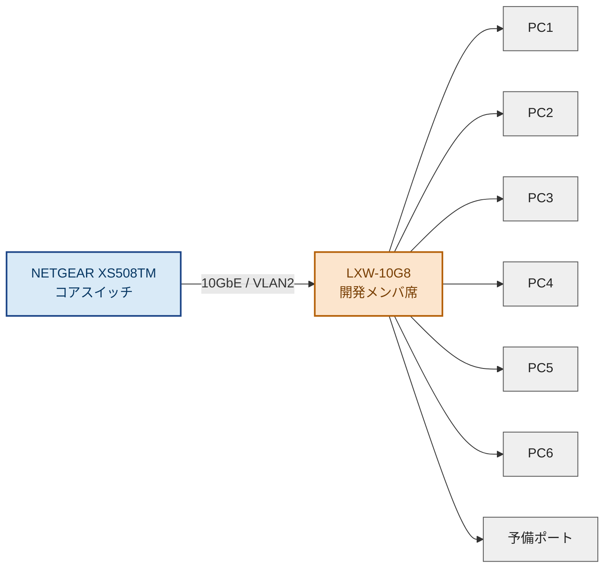
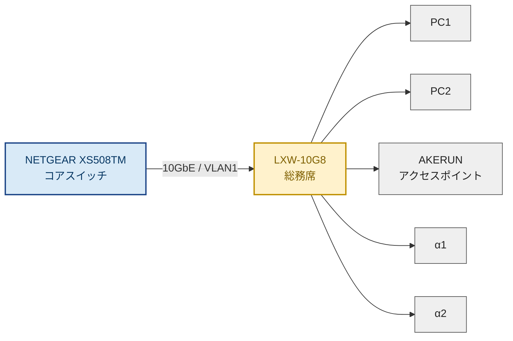
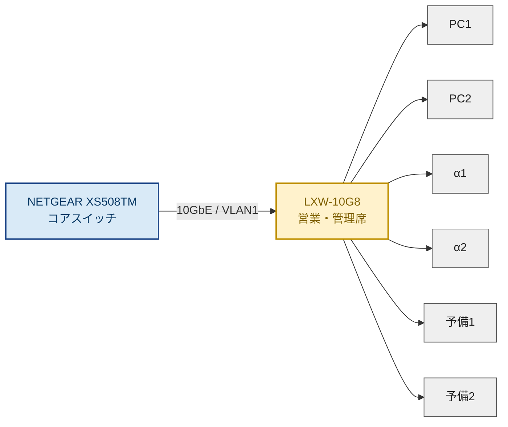

# ネットワーク機器ポート結線図（分割版・全体図簡略化）

本資料は、機器ポート結線図が小さく見づらい点を改善するため、**全体図**と**個別図**に分けて整理したものです。さらに、どのポートを使用するかが分かるよう、**ポート使用図**も追加しています。

- VLAN1：営業・総務管理
- VLAN2：開発メンバ席
- VLAN3：無線LAN
- 10GbE区間は **CAT6A** を前提
- 無線APは **NETGEAR BE9400** を使用
- 無線LANは **SSIDごとにVLAN 1・2・3を割り当て**
- 無線給電は **PoEエクステンダー** を使用
- **保守ターミナル** は RTX1300 の **LAN1** に接続

<div style="page-break-before:always"></div>

## 1. 全体図

> 見やすさを優先し、**個別図があるエリアは全体図ではBOX表現**としています。  
> 詳細な端末接続・ポート利用は、後続の個別図を参照してください。



### 全体結線の考え方

| 区間 | 接続内容 | 帯域 / 備考 |
|---|---|---|
| インターネット回線 → RTX1300 LAN2 | 回線接続 | 回線種別に依存 |
| 保守ターミナル → RTX1300 LAN1 | 保守用接続 | 1GbE想定 |
| RTX1300 → XS508TM | サーバラック内幹線 | 10GbE / タグVLAN 1,2,3 |
| XS508TM → 開発メンバ席LXW-10G8 | VLAN2幹線 | 10GbE |
| XS508TM → 総務席LXW-10G8 | VLAN1幹線 | 10GbE |
| XS508TM → 営業・管理席LXW-10G8 | VLAN1幹線 | 10GbE |
| XS508TM → プリンター | VLAN1直結 | 1GbE想定 |
| XS508TM → PoEエクステンダー | 無線LAN幹線 | 2.5GbE + PoE+ / タグVLAN 1,2,3 |
| PoEエクステンダー → NETGEAR BE9400 | AP給電・接続 | 2.5GbE + PoE+ / タグVLAN透過 |

> ※ プリンターは **XS508TMから直結**、AKERUNのアクセスポイントは **総務席LXW-10G8配下** とします。  

### RTX1300 ポート使用図

RTX1300の前面パネルに近い配置で表現しています。

- LAN1は8ポートのL2スイッチで、**上段が1・3・5・7、下段が2・4・6・8**
- LAN2は右側上段、LAN3は右側下段
- LAN2・LAN3は、それぞれRJ-45とSFP+のコンボポート
- 本構成ではRJ-45側を使用し、SFP+側は未使用

#### ポート割当

| 番号 | 物理ポート | 接続先 | 用途 / 備考 |
|---:|---|---|---|
| ① | LAN1 ポート1 | 保守ターミナル | 設定変更・障害対応用 |
| ② | LAN2 RJ-45 | インターネット回線 | 10GbE対応コンボポート |
| ③ | LAN3 RJ-45 | XS508TM | 10GbE幹線、タグVLAN 1・2・3 |


#### 前面ポート配置イメージ

<table>
  <thead>
    <tr>
      <th colspan="2">CONSOLE</th>
      <th colspan="4">LAN1（8ポート L2スイッチ）</th>
      <th colspan="2">LAN2 / LAN3 コンボポート</th>
    </tr>
  </thead>
  <tbody>
    <tr>
      <td rowspan="2"><strong>mini-USB</strong><br>-</td>
      <td rowspan="2"><strong>RJ-45 CONSOLE</strong><br>-</td>
      <td><strong>1</strong><br>①</td>
      <td><strong>3</strong><br>-</td>
      <td><strong>5</strong><br>-</td>
      <td><strong>7</strong><br>-</td>
      <td><strong>LAN2 RJ-45</strong><br>②</td>
      <td><strong>LAN2 SFP+</strong><br>-</td>
    </tr>
    <tr>
      <td><strong>2</strong><br>-</td>
      <td><strong>4</strong><br>-</td>
      <td><strong>6</strong><br>-</td>
      <td><strong>8</strong><br>-</td>
      <td><strong>LAN3 RJ-45</strong><br>③</td>
      <td><strong>LAN3 SFP+</strong><br>-</td>
    </tr>
  </tbody>
</table>

> LAN1は、実機と同じく上段が **1・3・5・7**、下段が **2・4・6・8** です。  
> LAN2・LAN3は、それぞれRJ-45とSFP+のコンボポートで、同一LAN番号内では排他利用です。


**運用担当者向けポイント**

- 保守ターミナルは、LAN1の左上にある **ポート1** に接続します。
- LAN1の **ポート2～8は「-」で、空き**です。
- インターネット回線は **LAN2のRJ-45ポート**です。
- XS508TMへの10GbE幹線は **LAN3のRJ-45ポート**です。
- LAN2・LAN3のSFP+スロットは、対応するRJ-45ポートと排他のため、この構成では使用しません。

### XS508TM ポート使用図

#### ポート割当

| 番号 | ポート | 接続先 | 備考 |
|---:|---|---|---|
| ① | Port 1 | RTX1300 LAN3 | 10GbE幹線、タグVLAN 1・2・3 |
| ② | Port 2 | 開発メンバ席 LXW-10G8 | 10GbE / VLAN2 |
| ③ | Port 3 | 総務席 LXW-10G8 | 10GbE / VLAN1 |
| ④ | Port 4 | 営業・管理席 LXW-10G8 | 10GbE / VLAN1 |
| ⑤ | Port 5 | PoEエクステンダー | 2.5GbE + PoE+ / タグVLAN 1・2・3 |
| ⑥ | Port 6 | プリンター | 1GbE / VLAN1 |


| XS508TM | 1 | 2 | 3 | 4 | 5 | 6 | 7 | 8 |
|---|---:|---:|---:|---:|---:|---:|---:|---:|
| 使用番号 | ① | ② | ③ | ④ | ⑤ | ⑥ | - | - |

### PoEエクステンダー ポート使用図

#### ポート割当

| 番号 | ポート | 接続先 | 備考 |
|---:|---|---|---|
| ① | IN | XS508TM Port 5 | 2.5GbE入力、タグVLAN透過 |
| ② | OUT | NETGEAR BE9400 | 2.5GbE + PoE+ |


| PoEエクステンダー | IN | OUT |
|---|---:|---:|
| 使用番号 | ① | ② |

### 無線LAN SSID・VLAN設計

NETGEAR BE9400では、SSIDごとに接続先VLANを分けます。無線端末は、接続したSSIDに応じて営業・総務管理、開発、ゲストの各ネットワークへ収容されます。

| SSID例 | 用途 | 割当VLAN | 主な利用者・端末 |
|---|---|---:|---|
| `Office-WiFi` | 営業・総務管理用 | VLAN 1 | 営業、総務、管理部門のノートPC・モバイル端末 |
| `Develop-WiFi` | 開発用 | VLAN 2 | 開発メンバーのノートPC・検証端末 |
| `Guest-WiFi` | ゲスト用 | VLAN 3 | 来客端末、社内ネットワークへ接続させない端末 |

#### 無線LAN側の設定要点

- **XS508TM Port 5** は、VLAN 1・2・3を通すタグ付きポートとして設定します。
- **PoEエクステンダー** は、VLANタグを変更せず透過させます。
- **NETGEAR BE9400** では、各SSIDに対応するVLAN IDを設定します。
- **RTX1300** では、各VLANのDHCP、ルーティング、アクセス制御を設定します。
- ゲスト用のVLAN 3は、インターネット接続のみ許可し、VLAN 1・2への通信を拒否します。

```text
Office-WiFi  → VLAN 1（営業・総務管理）
Develop-WiFi → VLAN 2（開発）
Guest-WiFi   → VLAN 3（ゲスト / 社内ネットワークから分離）
```

<div style="page-break-before:always"></div>

## 2. 個別図

### 2-1. 開発メンバ席（VLAN2）



#### 開発メンバ席 ポート割当

| 番号 | ポート | 接続先 | 備考 |
|---:|---|---|---|
| ① | Port 1 | XS508TM Port 2 | 10GbE uplink / VLAN2 |
| ② | Port 2 | PC1 | 10GbE |
| ③ | Port 3 | PC2 | 10GbE |
| ④ | Port 4 | PC3 | 10GbE |
| ⑤ | Port 5 | PC4 | 10GbE |
| ⑥ | Port 6 | PC5 | 10GbE |
| ⑦ | Port 7 | PC6 | 10GbE |

#### 開発メンバ席 ポート使用図

| LXW-10G8 | 1 | 2 | 3 | 4 | 5 | 6 | 7 | 8 |
|---|---:|---:|---:|---:|---:|---:|---:|---:|
| 使用番号 | ① | ② | ③ | ④ | ⑤ | ⑥ | ⑦ | - |

<div style="page-break-before:always"></div>

### 2-2. 総務席（VLAN1）



#### 総務席 ポート割当

| 番号 | ポート | 接続先 | 備考 |
|---:|---|---|---|
| ① | Port 1 | XS508TM Port 3 | 10GbE uplink / VLAN1 |
| ② | Port 2 | PC1 | 10GbE |
| ③ | Port 3 | PC2 | 10GbE |
| ④ | Port 4 | AKERUNアクセスポイント | VLAN1 |

#### 総務席 ポート使用図

| LXW-10G8 | 1 | 2 | 3 | 4 | 5 | 6 | 7 | 8 |
|---|---:|---:|---:|---:|---:|---:|---:|---:|
| 使用番号 | ① | ② | ③ | ④ | - | - | - | - |

---

### 2-3. 営業・管理席（VLAN1）



#### 営業・管理席 ポート割当

| 番号 | ポート | 接続先 | 備考 |
|---:|---|---|---|
| ① | Port 1 | XS508TM Port 4 | 10GbE uplink / VLAN1 |
| ② | Port 2 | PC1 | 10GbE |
| ③ | Port 3 | PC2 | 10GbE |

#### 営業・管理席 ポート使用図

| LXW-10G8 | 1 | 2 | 3 | 4 | 5 | 6 | 7 | 8 |
|---|---:|---:|---:|---:|---:|---:|---:|---:|
| 使用番号 | ① | ② | ③ | - | - | - | - | - |

<div style="page-break-before:always"></div>

## 3. 補足

- 本資料は**結線の見やすさを優先**して、全体図と個別図に分割しています。
- 実際のポート番号は、ラック配置・配線距離・機器の設置位置に合わせて最終調整してください。
- プリンターはVLAN1として **XS508TMへ直結** します。
- AKERUNのアクセスポイントはVLAN1として **総務席LXW-10G8へ接続** します。
- 保守ターミナルは **RTX1300 の LAN1** へ接続し、設定変更・障害対応用に使用します。
- 無線LANはSSIDごとにVLAN 1・2・3へ分離し、ゲスト用VLAN 3から社内VLAN 1・2への通信はRTX1300で拒否します。
- 本物の画像ベースにしたい場合は、**XS508TM / LXW-10G8 / RTX1300 / BE9400 / PoEエクステンダー** の前面画像をご提供いただければ、その画像上に「Port 1 = uplink」などの注記を入れる形で、より実機に近い資料へできます。
